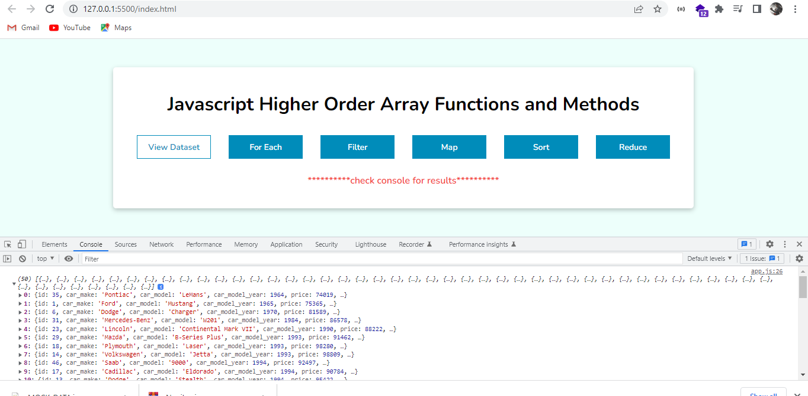

# JavaScript Higher Order Functions

---

## app.js

---

The app.js file contains the illustration for each higher order functions that can be executed on arrays for manipulation which includes:

- forEach()
- filter()
- map()
- sort()
- reduce()

## MOCK_DATA.json

---

This file contains sample of array of 50 objects with keys - id, car_make, car_model, car_model_year, price, is_available

### here is how the data looks like

```json
[
	{"id":1,"car_make":"Ford","car_model":"Mustang","car_model_year":1965,"price":75365,"is_available":true},
{"id":2,"car_make":"Ford","car_model":"Focus","car_model_year":2004,"price":99057,"is_available":false},
{"id":3,"car_make":"Kia","car_model":"Spectra","car_model_year":2009,"price":57654,"is_available":true},
{"id":4,"car_make":"GMC","car_model":"Suburban 2500","car_model_year":1999,"price":74185,"is_available":true},
{"id":5,"car_make":"Ford","car_model":"Transit Connect","car_model_year":2010,"price":60921,"is_available":false}
.
.
.
]
```

## Index.html and style.css

---

Contains the basic UI for of the project with buttons to executed the methods and log results  in console

for example: on clicking “View Dataset” button all the results of the dataset are logged in console



---